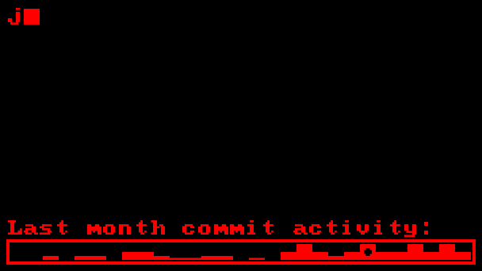
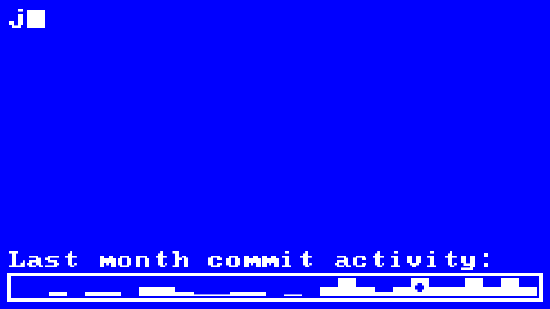

<h1 align="center">Metrix</h1>
<p align="center">Metrix generates a customizable retro-style GIF infographic showcasing GitHub metrics for your GitHub README profile. Choose your color combination with the <a href="https://joanroig.github.io/metrix-gallery">Metrix Gallery</a>.
</p>

<table align="center">
  <tr>
    <td align="center">
      <a href="#default"></a>
    </td>
    <td align="center">
      <a href="#red"></a>
    </td>
    <td align="center">
      <a href="#blue"></a>
    </td>
  </tr>
  <tr>
    <td align="center">
      <a href="#default"><b>Default</b></a>
    </td>
    <td align="center">
      <a href="#red"><b>Red</b></a>
    </td>
    <td align="center">
      <a href="#blue"><b>White-Blue</b></a>
    </td>
  </tr>
  <tr>
    <td align="center">
      <a href="#yellow-noglitch"
        ></a>
    </td>
    <td align="center">
      <a href="#gold-customtext"
        ></a>
    </td>
    <td align="center">
      <a href="#purple-torvalds"
        ></a>
    </td>
  </tr>
  <tr>
    <td align="center">
      <a href="#yellow-noglitch"><b>Yellow No-Glitch</b></a>
    </td>
    <td align="center">
      <a href="#gold-customtext"><b>Gold Custom Text</b></a>
    </td>
    <td align="center">
      <a href="#purple-torvalds"><b>Purple Torvalds</b></a>
    </td>
  </tr>
</table>

## Usage Guide

Follow these steps to integrate Metrix into your GitHub profile:

1.  **Create a New Repository**  
    Create a new repository to host your profile README. For guidance, refer to GitHub’s documentation on [setting up and managing your profile README](https://docs.github.com/en/account-and-profile/setting-up-and-managing-your-github-profile/customizing-your-profile/managing-your-profile-readme).

2.  **(Optional) Generate and Add a Personal Access Token (PAT)**  
    By default, the action will only display public data. To also include private repository data, follow these steps:

    1. Create a PAT token from [GitHub's Token Settings](https://github.com/settings/tokens) with the following permissions:

       - **repo**: Full control of private repositories
       - **read:org**: Read org and team membership, and org projects
       - **read:user**: Read all user profile data

    2. In your repository, navigate to **Settings > Secrets and variables** and add a new secret:

       - Name the secret `PAT_TOKEN`
       - Paste the PAT token value generated in the previous step

3.  **Enable Workflow Permissions**  
    In your repository settings, go to **Settings > Actions > General** and enable **"Read repository contents and packages permissions"** at the bottom of the page.

4.  **Add the Metrix GIF to Your README**  
     Create a new `README.md` like this:

    ```markdown
    <p align="center">
      <a href="https://github.com/joanroig/metrix" title="View Metrix on GitHub">
        
      </a>
      <br/>
      <sub>Infographic generated with <a href="https://github.com/joanroig/metrix">joanroig/metrix</a></sub>
    </p>
    ```

    Or add the following to your `README.md` file:

    ```markdown
    [](https://github.com/joanroig/metrix)
    ```

    You can see a live example here: https://github.com/joanroig/joanroig/blob/main/README.md

5.  **Create a GitHub Action**  
    In your repository, create a new file at `.github/workflows/metrix.yml` and paste the following content:

    ```yaml
    name: Generate Metrics GIF

    on:
      # Run manually from the Actions tab
      workflow_dispatch:
      # Run on schedule (adjust as needed)
      schedule:
        - cron: "0 0 * * 0" # Weekly on Sundays at midnight

    jobs:
      generate:
        runs-on: ubuntu-latest
        steps:
          - name: Generate Metrix
            uses: joanroig/metrix@main
            with:
              GITHUB_TOKEN: ${{ secrets.PAT_TOKEN || secrets.GITHUB_TOKEN }}
              GITHUB_USERNAME: ${{ github.actor }}
              # You can add more customization parameters here
    ```

    You can find an example with all the default configuration in the [metrix-complete.yml](.github/workflows/metrix-complete.yml) file.

6.  **Run the Action**  
    Your action is now set up! Commit the changes and manually trigger the action to generate the metrics GIF.

7.  **(Optional) Customize your Metrix**  
    You can use the [metrix-complete.yml](.github/workflows/metrix-complete.yml) file or read the [parameters](#parameters) section to find some parameters to add and customize in your action. Lots of interesting color combinations can be found using the <a href="https://joanroig.github.io/metrix-gallery">Metrix Gallery</a>.

## Showcase

<p align="center">
<a href="https://joanroig.github.io/metrix-gallery">
  
  </a>
</p>

Some examples are provided below, with the corresponding configuration for each:

---

### <a id="default"></a> Default

> Notice that looping is deactivated by default!


```
with:
  GITHUB_USERNAME: 'joanroig'
```

---

### <a id="red"></a> Red


```
with:
  GITHUB_USERNAME: 'joanroig'
  TEXT_COLOR: 'red'
  LOOP: 'true'
```

---

### <a id="blue"></a> White over blue


```
with:
  GITHUB_USERNAME: 'joanroig'
  TEXT_COLOR: 'white'
  BACKGROUND_COLOR: 'blue'
  LOOP: 'true'
```

---

### <a id="yellow-noglitch"></a> Yellow with disabled glitches


```
with:
  GITHUB_USERNAME: 'joanroig'
  TEXT_COLOR: 'yellow'
  GLITCHES: 'false'
  LOOP: 'true'
```

---

### <a id="gold-customtext"></a> Gold over dark gold, with custom texts


```
with:
  GITHUB_USERNAME: 'joanroig'
  TEXT_COLOR: 'gold'
  BACKGROUND_COLOR: 'darkgoldenrod'
  ACTIVITY_TEXT: 'I worked a lot lately...'
  TEXT: |
  {username} is booting up......
  -----------------------

  Joined GitHub {created_at}
  Followed by {followers} Users
  Owner of {total_repos} Repos

  Total Commits: {total_commits}
  Total Stars: {total_stars}

  Data updated: {updated_date}
  LOOP: 'true'
```

---

### <a id="purple-torvalds"></a> Yellow over purple, with data from another user, reduced activity days, and custom activity text


```
with:
  GITHUB_USERNAME: 'torvalds'
  TEXT_COLOR: 'yellow'
  BACKGROUND_COLOR: 'purple'
  ACTIVITY_TEXT: 'Last two weeks were intense:'
  ACTIVITY_DAYS: '14'
  LOOP: 'true'
```

---

## <a id="parameters"></a>Available Parameters and Options

Metrix is highly customizable through GitHub Action arguments. A complete example, including the default parameters, is provided: [metrix-complete.yml](.github/workflows/metrix-complete.yml). Below is the full list of available parameters:

| **Parameter**      | **Description**                                                                                                                                    | **Example/Options**                                                                                                    |
| ------------------ | -------------------------------------------------------------------------------------------------------------------------------------------------- | ---------------------------------------------------------------------------------------------------------------------- |
| GITHUB_TOKEN       | GitHub token used for authentication. Defaults to `PAT_TOKEN` if available.                                                                        | `${{ secrets.PAT_TOKEN \|\| secrets.GITHUB_TOKEN }}`                                                                   |
| GITHUB_USERNAME    | GitHub username to display the metrics for.                                                                                                        | `${{ github.actor }}`                                                                                                  |
| LOG_LEVEL          | Application log level.                                                                                                                             | `'NOTSET'`, `'DEBUG'`, `'INFO'`, `'WARNING'`, `'ERROR'`, `'FATAL'`                                                     |
| FFMPEG_LOG_LEVEL   | FFmpeg log level.                                                                                                                                  | `'DEBUG'`, `'VERBOSE'`, `'INFO'`, `'WARNING'`, `'ERROR'`, `'FATAL'`, `'PANIC'`, `'QUIET'`                              |
| FONT_SIZE          | Font size for the main text. Note: Not tested, may cause rendering issues.                                                                         | `'20'`                                                                                                                 |
| SYMBOL_FONT_SIZE   | Font size for symbols. Note: Not tested, may cause rendering issues.                                                                               | `'20'`                                                                                                                 |
| FONT_PATH          | Path to the primary font file. Note: Not tested, may cause rendering issues.                                                                       | `'assets/MxPlus_IBM_BIOS.ttf'`                                                                                         |
| SYMBOL_FONT_PATH   | Path to the symbol font file. Note: Not tested, may cause rendering issues.                                                                        | `'assets/MxPlus_IBM_BIOS.ttf'`                                                                                         |
| BACKGROUND_COLOR   | Background color. Same options as TEXT_COLOR.                                                                                                      | `'red'`,`'#6e2e2a'`,`'random'`, `'random-light'`, `'random-dark'`, `'complementary'`, `'contrasting'`, `'shade'`, etc  |
| TEXT_COLOR         | Color of the text. Options include CSS color names, hex codes, 'random', 'random-light', 'random-dark', 'complementary', 'contrasting' or 'shade'. | `'blue'`,`'#c4a5a3'`,`'random'`, `'random-light'`, `'random-dark'`, `'complementary'`, `'contrasting'`, `'shade'`, etc |
| MINIMUM_CONTRAST   | Minimum contrast ratio between text and background (1 to 21).                                                                                      | `'2'`                                                                                                                  |
| TEXT               | Text content for the Metrix display. Use variables for dynamic data. See [Text Variables](#variables) below.                                       | `'My name is {username}`<br>`I love {preferred_languages[1]},`<br>`and I have {total_stars} stars'`                    |
| TYPING_CHARACTER   | Character used for the typing effect.                                                                                                              | `'█'`                                                                                                                  |
| ACTIVITY           | Enable or disable the activity section.                                                                                                            | `'true'` or `'false'`                                                                                                  |
| ACTIVITY_TEXT      | Text to display for the activity section.                                                                                                          | `'Last month commit activity:'`                                                                                        |
| ACTIVITY_DAYS      | Number of days for the activity chart.                                                                                                             | `'30'`                                                                                                                 |
| FPS                | Frames per second for the GIF.                                                                                                                     | `'50'`                                                                                                                 |
| LOOP               | Enable or disable infinite looping of the GIF.                                                                                                     | `'true'` or `'false'`                                                                                                  |
| WIDTH              | Width of the generated GIF.                                                                                                                        | `'622'`                                                                                                                |
| HEIGHT             | Height of the generated GIF.                                                                                                                       | `'356'`                                                                                                                |
| GLITCHES           | Enable or disable glitches in the GIF.                                                                                                             | `'true'` or `'false'`                                                                                                  |
| MAX_GLITCHES       | Maximum number of glitches that can occur simultaneously.                                                                                          | `'4'`                                                                                                                  |
| GLITCH_PROBABILITY | Probability of a glitch occurring in a frame (0 to 100).                                                                                           | `'3'`                                                                                                                  |
| OUTPUT_FILE_PATH   | Path for the generated GIF.                                                                                                                        | `'metrix.gif'`                                                                                                         |

### <a id="variables"></a>Text Variables (Curated GitHub API Data)

| **Variable**                                          | **Description**                                                                      | **Example Replacement**            |
| ----------------------------------------------------- | ------------------------------------------------------------------------------------ | ---------------------------------- |
| `{username}`                                          | GitHub username                                                                      | `'joanroig'`                       |
| `{separator}`                                         | Custom separator for formatting                                                      | `'------------------------------'` |
| `{updated_date}`                                      | Date of the latest update                                                            | `'2025-04-05'`                     |
| `{total_repos}`                                       | Total number of repositories                                                         | `'42'`                             |
| `{total_commits}`                                     | Total number of commits                                                              | `'500'`                            |
| `{total_stars}`                                       | Total number of stars across repositories                                            | `'150'`                            |
| `{total_forks}`                                       | Total number of forks                                                                | `'30'`                             |
| `{total_watchers}`                                    | Total number of watchers                                                             | `'100'`                            |
| `{total_open_issues}`                                 | Total number of open issues                                                          | `'10'`                             |
| `{preferred_languages}` or `{preferred_languages[X]}` | Preferred programming languages, where X can be set to a number to limit the results | `'TypeScript, Python, JavaScript'` |
| `{preferred_topics}` or `{preferred_topics[X]}`       | Preferred topics, where X can be set to a number to limit the results                | `'API, Hacking'`                   |
| `{preferred_licenses}` or `{preferred_licenses[X]}`   | Preferred license types, where X can be set to a number to limit the results         | `'MIT','GPL'`                      |

#### Extended Text Variables (Raw GitHub API Data)

These variables are sourced directly from the GitHub User API data without any transformations, except for the reformatting of dates. Please note that this data may change over time, and the variables listed were the ones available at the time of writing:

| **Variable**                  | **Description**                            | **Example**                         |
| ----------------------------- | ------------------------------------------ | ----------------------------------- |
| `{login}`                     | GitHub login name                          | `'joanroig'`                        |
| `{id}`                        | Unique GitHub user ID                      | `'123456789'`                       |
| `{node_id}`                   | Node identifier                            | `'MDQ6VXNlcjEyMzQ1Njc4OQ=='`        |
| `{type}`                      | Type of account (e.g., "User")             | `'User'`                            |
| `{user_view_type}`            | User view type (e.g., "private")           | `'private'`                         |
| `{site_admin}`                | Site administrator status (Boolean)        | `'false'`                           |
| `{name}`                      | Display name                               | `'Joan Roig'`                       |
| `{company}`                   | Company name (if provided)                 | `'Company Inc.'`                    |
| `{blog}`                      | Blog URL                                   | `'https://blog.example.com'`        |
| `{location}`                  | User location                              | `'Barcelona, Spain'`                |
| `{email}`                     | Email address (if provided)                | `'joan@example.com'`                |
| `{hireable}`                  | Hireable status (if provided)              | `'true'`                            |
| `{bio}`                       | Biography                                  | `'Software developer and musician'` |
| `{twitter_username}`          | Twitter username                           | `'@joanroig'`                       |
| `{public_repos}`              | Count of public repositories               | `'35'`                              |
| `{public_gists}`              | Count of public gists                      | `'5'`                               |
| `{followers}`                 | Number of followers                        | `'200'`                             |
| `{following}`                 | Number of users followed                   | `'150'`                             |
| `{created_at}`                | Date the GitHub account was created        | `'2015-05-17'`                      |
| `{updated_at}`                | Date the GitHub account was last updated   | `'2025-04-05'`                      |
| `{private_gists}`             | Count of private gists                     | `'10'`                              |
| `{total_private_repos}`       | Total number of private repositories       | `'10'`                              |
| `{owned_private_repos}`       | Count of owned private repositories        | `'5'`                               |
| `{disk_usage}`                | Disk usage in kilobytes                    | `'50000'`                           |
| `{collaborators}`             | Number of collaborators                    | `'10'`                              |
| `{two_factor_authentication}` | Two-factor authentication status (Boolean) | `'true'`                            |

## Development Setup

### Requirements

- **Conda** or **Miniconda** (alternatively, only Python)
- **FFmpeg**
- **VSCode** (optional, for debugging and development)

### Setup

1. Clone this repository and open it in your IDE (e.g., **VSCode**).
2. Add your **PAT** token to the `.github_token` file.
3. If you have **Conda** installed, run `rebuild_env.ps1` to set up the Conda environment, then execute `run.ps1` to start the application. Otherwise, read the two scripts to run the commands using Python.

### Running and Debugging with VS Code

The project includes preconfigured launch settings in the `.vscode/launch.json` file that make it easy to run Metrix:

1. **Python: Debug** - Runs the main application with a default configuration
   - Renders a standard Metrix GIF with GitHub user stats
   - Sets appropriate environment variables for colors, fonts, and display settings

To run the application:

1. Open the Debug panel in VS Code (Ctrl+Shift+D or click the debug icon in the sidebar)
2. Select "Python: Debug" from the dropdown at the top
3. Click the green play button or press F5

For running test scripts and bulk generation tools, see the [tests documentation](src/tests/README.md).

## Credits

Fonts by **VileR**: [Oldschool PC Fonts](https://int10h.org/oldschool-pc-fonts/fontlist/)

## License

This project is licensed under the [MIT License](LICENSE).
