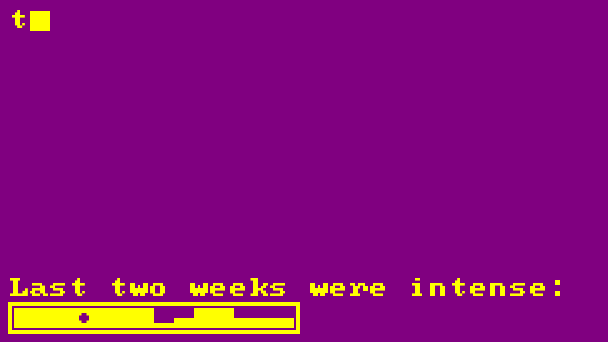

<h1 align="center">Metrix</h1>
<p align="center">Metrix generates a customizable retro-style GIF showcasing GitHub metrics for your GitHub README profile.</p>

<table align="center">
  <tr>
    <td align="center">
      <a href="#default"></a>
    </td>
    <td align="center">
      <a href="#red"></a>
    </td>
    <td align="center">
      <a href="#blue"></a>
    </td>
  </tr>
  <tr>
    <td align="center">
      <a href="#default"><b>Default</b></a>
    </td>
    <td align="center">
      <a href="#red"><b>Red</b></a>
    </td>
    <td align="center">
      <a href="#blue"><b>White-Blue</b></a>
    </td>
  </tr>
  <tr>
    <td align="center">
      <a href="#yellow-noglitch"
        ></a>
    </td>
    <td align="center">
      <a href="#gold-customtext"
        ></a>
    </td>
    <td align="center">
      <a href="#purple-torvalds"
        ></a>
    </td>
  </tr>
  <tr>
    <td align="center">
      <a href="#yellow-noglitch"><b>Yellow No-Glitch</b></a>
    </td>
    <td align="center">
      <a href="#gold-customtext"><b>Gold Custom Text</b></a>
    </td>
    <td align="center">
      <a href="#purple-torvalds"><b>Purple Torvalds</b></a>
    </td>
  </tr>
</table>

## Usage Guide

Follow these steps to integrate Metrix into your GitHub profile:

1. **Create a New Repository**  
   Create a new repository to host your profile README. For guidance, refer to GitHub’s documentation on [setting up and managing your profile README](https://docs.github.com/en/account-and-profile/setting-up-and-managing-your-github-profile/customizing-your-profile/managing-your-profile-readme).

2. **(Optional) Generate and Add a Personal Access Token (PAT)**  
   By default, the action will only display public data. To also include private repository data, follow these steps:

   1. Create a PAT token from [GitHub's Token Settings](https://github.com/settings/tokens) with the following permissions:

      - **repo**: Full control of private repositories
      - **read:org**: Read org and team membership, and org projects
      - **read:user**: Read all user profile data

   2. In your repository, navigate to **Settings > Secrets and variables** and add a new secret:

      - Name the secret `PAT_TOKEN`
      - Paste the PAT token value generated in the previous step

3. **Enable Workflow Permissions**  
   In your repository settings, go to **Settings > Actions > General** and enable **"Read repository contents and packages permissions"** at the bottom of the page.

4. **Add the Metrix GIF to Your README**  
   Add the following to your `README.md` file:

   ```markdown
   
   ```

5. **Create a GitHub Action**  
   In your repository, create a new GitHub Action by copying the contents of the [metrix.yml](.github/workflows/metrix.yml) file.  
   Customize the parameters in the workflow as you like.

6. **Run the Action**  
   Your action is now set up! Commit the changes and trigger the action to generate the metrics GIF.

## Showcase

Some examples are provided below, with the corresponding configuration for each:

---

### <a id="default"></a> Default

> Notice that looping is deactivated by default!


```
with:
  GITHUB_USERNAME: 'joanroig'
```

---

### <a id="red"></a> Red


```
with:
  GITHUB_USERNAME: 'joanroig'
  TEXT_COLOR: 'red'
  LOOP: 'true'
```

---

### <a id="blue"></a> White over blue


```
with:
  GITHUB_USERNAME: 'joanroig'
  TEXT_COLOR: 'white'
  BACKGROUND_COLOR: 'blue'
  LOOP: 'true'
```

---

### <a id="yellow-noglitch"></a> Yellow with disabled glitches


```
with:
  GITHUB_USERNAME: 'joanroig'
  TEXT_COLOR: 'yellow'
  GLITCHES: 'false'
  LOOP: 'true'
```

---

### <a id="gold-customtext"></a> Gold over dark gold, with custom texts


```
with:
  GITHUB_USERNAME: 'joanroig'
  TEXT_COLOR: 'gold'
  BACKGROUND_COLOR: 'darkgoldenrod'
  TITLE_SUFFIX: ' is booting up......'
  ACTIVITY_TEXT: 'I worked a lot lately...'
  LOOP: 'true'
```

---

### <a id="purple-torvalds"></a> Yellow over purple, with data from another user, reduced activity days, and custom activity text


```
with:
  GITHUB_USERNAME: 'torvalds'
  TEXT_COLOR: 'yellow'
  BACKGROUND_COLOR: 'purple'
  ACTIVITY_TEXT: 'Last two weeks were intense:'
  ACTIVITY_DAYS: '14'
  LOOP: 'true'
```

---

## Development Setup

### Requirements

- **Conda** or **Miniconda** (alternatively, only Python)
- **FFmpeg**
- **VSCode** (optional, for debugging and development)

### Setup

1. Clone this repository and open it in your IDE (e.g., **VSCode**).
2. Add your **PAT** token to the `.github_token` file.
3. If you have **Conda** installed, run `rebuild_env.ps1` to set up the Conda environment, then execute `run.ps1` to start the application. Otherwise, read the two scripts to run the commands using Python.
4. For debugging, use the provided **Run** and **Debug** configurations.

## Credits

Fonts by **VileR**: [Oldschool PC Fonts](https://int10h.org/oldschool-pc-fonts/fontlist/)

## License

This project is licensed under the [MIT License](LICENSE).
